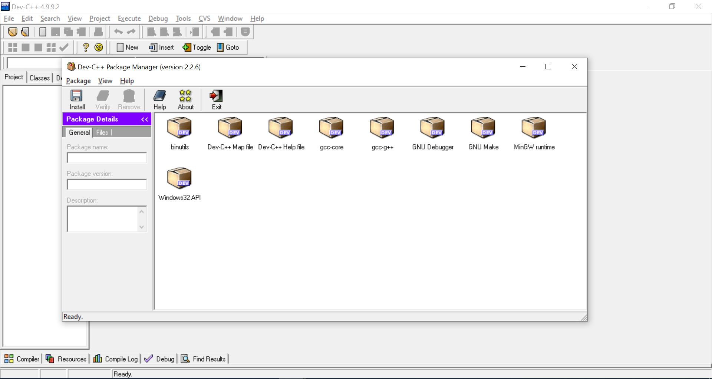

Dev C++
----

Bloodshed Dev-C++ is a full-featured Integrated Development Environment (IDE) for C/C++, by Bloodshed Software.

Dev is free and can be downloaded straightly from Bloodshed's website.

[Download Link](https://www.bloodshed.net/download.html)

---

## Why Dev?

#### Designed for C/C++.

It is specifically designed for C/C++, so it makes coding in those languages easier

#### It is an IDE

You can run the program directly in the Dev window without having to run g++ and then run the output of that. 

#### It is exclusively on Windows

Feel superior to your Mac and Linux peers

#### DevPaks

DevPaks are packaged extensions on the programming environment. They include everything from libraries, templates, and utilities. A typical devpak will work with any MinGW distribution (with any IDE for MinGW)

To install DevPaks, go to "Tools" on the program and click on "Package Manager" (or alternatively,  navigate to your installation directory and open PackMan.exe). It should look something like this:

Another way to install packages is go to "Tools" and "Check for Updates/Packages". 

Unfortunately, it seems that "Check for Updates/Packages" mirrors are down, and I could not find standalone devpaks to install. The recommended DevPaks.org only provides a corrupted tar file and I'm unable to actually install any DevPaks. 

However, presuming that you found a standalone, uncorrupted devpak, you would simply press "Install" and locate it in your directory. If you're just using Dev C++ for DevPaks, I would recommend some other Text Editor/IDE for now.